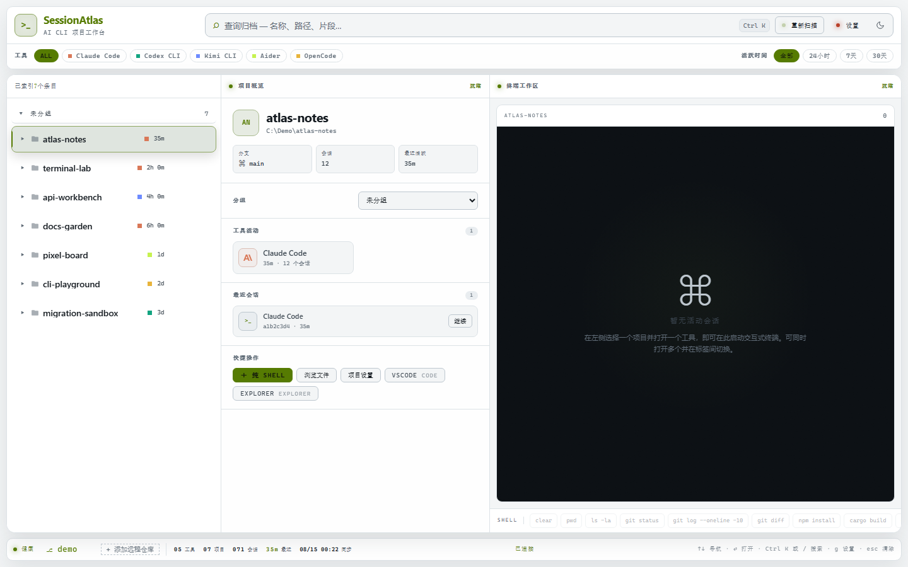

# SessionAtlas

[English](./README.en.md) | 简体中文

[](https://github.com/juliohuang/SessionAtlas/actions/workflows/ci.yml)
[](https://github.com/juliohuang/SessionAtlas/actions/workflows/security.yml)
[](./LICENSE)
[](https://github.com/juliohuang/SessionAtlas/releases)

把 Claude Code、Codex、Kimi、OpenCode 和 Aider 分散在本机的项目与会话，整理成一张可搜索、可继续工作的地图。



SessionAtlas 由三个协作组件组成：

- **Windows 桌面控制台（当前主界面）**：浏览项目、全文搜索、管理分组，并在多标签 PTY 终端中继续 AI CLI 会话。
- **`sessionatlas` CLI（规范扫描器）**：扫描各工具的本地记录，按规范化路径去重，将索引写入 `~/.sessionatlas/index.db`。
- **Avalonia 桌面端（历史参考）**：复用 C# 核心代码，但已不作为推荐界面。

> SessionAtlas 是独立的开源项目，与 `sessionatlas.nl` 及其所有者没有关联、认可或合作关系。发布前请同时评估项目名称的商标风险。

## 适合谁

如果你同时使用多个 AI 编程 CLI，经常忘记“某个项目上次是用哪个工具、哪个会话做的”，SessionAtlas 可以把这些本地痕迹统一起来。它不会替你购买、安装或登录 AI 服务。

## 安装

### Windows 桌面版（Beta）

从 [GitHub Releases](https://github.com/juliohuang/SessionAtlas/releases/latest) 下载最新的 `.msi` 或 `-setup.exe`。安装包已包含 `sessionatlas` 扫描 CLI；首次启动后点击“重新扫描”即可建立索引，无需另装 .NET Runtime。

要求：

- Windows 10/11 x64；
- WebView2 Runtime（Windows 11 通常已包含）；
- 至少一个已安装并完成登录的受支持 AI CLI，才可启动对应会话。

首个公开版本是 Beta。升级前建议保留 `~/.sessionatlas/`；如遇问题请查看[支持说明](./SUPPORT.md)或提交 issue。

### 从源码运行 CLI

需要 [.NET 8 SDK](https://dotnet.microsoft.com/download/dotnet/8.0)：

```bash
dotnet run -- scan
dotnet run -- list
dotnet run -- search <query>
dotnet run -- open [path]
dotnet run -- recent
dotnet run -- config
```

CLI 源码在 Windows、macOS 和 Linux 上构建与测试；当前自动发布的桌面安装包仅面向 Windows x64。

## 支持的工具

| 工具 | 扫描来源 | 启动命令 |
| --- | --- | --- |
| Claude Code | `~/.claude/projects/**/*.jsonl` | `claude` |
| Codex CLI | `~/.codex/sessions/**/*.jsonl` | `codex` |
| Kimi CLI | `~/.kimi-code/sessions/**/state.json` | `kimi` |
| OpenCode | `~/.local/share/opencode/opencode.db` | `opencode` |
| Aider | 常用开发目录中的 `.aider.chat.history` | `aider` |

还可以通过 `sessionatlas config add-tool` 添加符合安全约束的自定义工具。

## 主要能力

- 统一扫描、路径去重、SQLite FTS5 全文搜索；
- 按工具和最近访问时间筛选，自定义分组与拖拽排序；
- 多标签真实 PTY 终端与最近会话继续入口；
- 可配置 VS Code、资源管理器、终端等外部打开器；
- 免密密钥/agent 模式的远程 SSH 索引；
- 中英文界面与键盘操作；
- 浏览器演示模式：不在 Tauri 中运行时使用内置样例数据。

## 隐私与安全

- **本地优先**：索引、偏好和配置只保存在 `~/.sessionatlas/`，项目不包含遥测或云端同步。
- **读取边界**：扫描器会读取受支持工具留在本机的数据目录，以提取项目路径、时间和会话元数据；不会把这些内容上传给 SessionAtlas 服务。
- **执行边界**：SessionAtlas 会按用户操作启动本机 AI CLI、终端、Git 或 SSH。第三方工具自己的网络访问和数据策略仍由它们负责。
- **正常权限策略**：批量 Claude 任务不会加入跳过权限检查的参数；需要批准的操作可能停下来等待用户。
- **本地资源**：xterm.js、语法高亮和字体不依赖 CDN。第三方声明见 [THIRD_PARTY_NOTICES.md](./THIRD_PARTY_NOTICES.md)。

安全执行约束见 [`docs/execution-security-contract.md`](./docs/execution-security-contract.md)。发现安全问题时，请不要公开披露；正式私密报告流程会记录在 `SECURITY.md`。

## 本地开发

需要 .NET 8、Rust stable、Node.js 20+、Tauri 2 的系统依赖。

```bash
# C# CLI 与测试
dotnet build
dotnet test SessionAtlas.Tests

# 前端
cd frontend
npm ci
npm run check
npm test

# Tauri
cd ../src-tauri
cargo fmt -- --check
cargo clippy --all-targets -- -D warnings
cargo test
cargo tauri build
```

`cargo tauri dev/build` 会先为当前平台发布自包含的 C# CLI，并将它作为 Tauri sidecar 打包。测试必须使用临时 `SESSIONATLAS_HOME`，不得读取或修改真实的 `~/.sessionatlas/`。

架构说明见 [AGENTS.md](./AGENTS.md)，扫描契约见 [`docs/scan-contract.md`](./docs/scan-contract.md)，测试基线见 [`docs/test-baseline.md`](./docs/test-baseline.md)。

## 项目状态

SessionAtlas 正在准备首个公开 Beta。当前路线图见 [ROADMAP.md](./ROADMAP.md)，版本变化见 [CHANGELOG.md](./CHANGELOG.md)。

## 参与贡献

欢迎 bug 报告、功能建议、文档改进与代码贡献。开始前请阅读 [CONTRIBUTING.md](./CONTRIBUTING.md) 和 [CODE_OF_CONDUCT.md](./CODE_OF_CONDUCT.md)。

## 许可证

本项目以 [Apache License 2.0](./LICENSE) 发布。项目名称与标识不因该许可证自动授予商标使用权；详见 [NOTICE](./NOTICE)。
